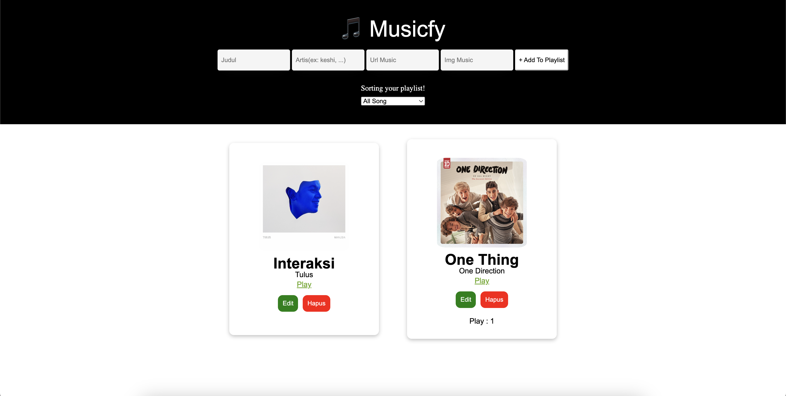

# Module 2.3 - Musicfy


- Muhamad Putra Satria
- GG3FSGP0442

## Cara Penggunaan

### Clone Proyek

Anda dapat mendapatkan salinan proyek ini dengan melakukan clone dari repository ini ke dalam direktori lokal Anda menggunakan perintah berikut:

```bash
git clone https://github.com/mpsalunggg/module2.3_Musicfy.git
```

### Install Nodemon (Opsional)

Bisa menginstall nodemon secara global

```bash
npm install -g nodemon
```

### Menjalankan Server

Jika menggunakan nodemon maka :

```bash
nodemon index.js
```

Jika tanpa menggunakan nodemon maka :

```bash
npm run start
```
Setelah menjalakan salah satu perintah diatas maka otomatis akan menjalakan diport 3001

